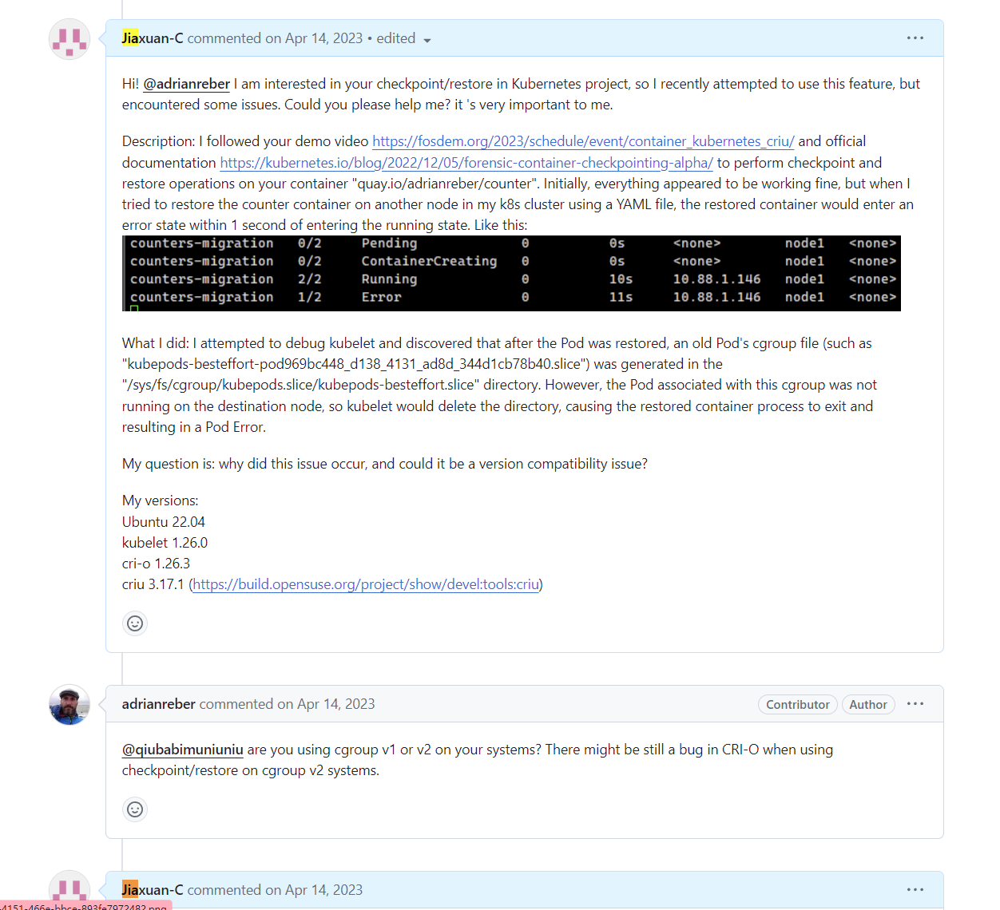
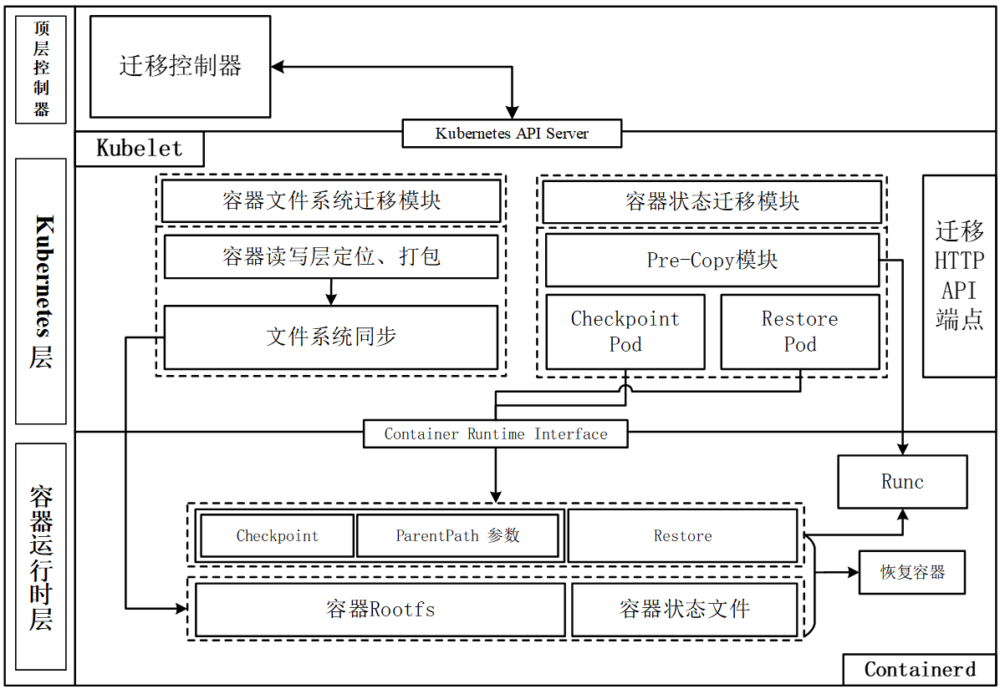
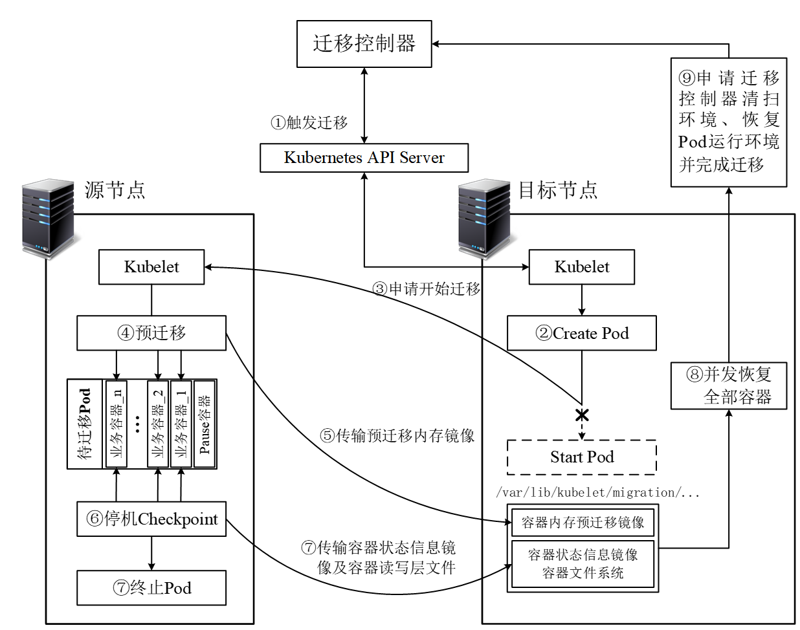

# 〇、声明
**如果您仅想快速了解本项目在干什么，请参考*第二部分*内容并观看视频即可(3min钟短视频)**

https://www.bilibili.com/video/BV1nA4m1P7w1/?vd_source=f5d12b3894e2c1a98b31ea20b7fb0c88

**如果您想进一步了解本项目的架构、思想以及改进请阅读下文**
* [一、前言](#一、前言(这不重要，可以直接看第四部分的效果演示))
* [二、基本功能介绍](#二、基本功能介绍)
* [三、效果演示](#三、效果演示)
* [四、快速启动](#四、快速启动(其实麻烦的，建议叫龟速启动))
* [五、架构设计及原理概要](#五、架构设计及原理概要)
* [六、目前待优化的点、未来此方向前景展望](#六、目前待优化的点、未来此方向前景展望)
  

# 一、前言(这不重要，可以直接看第四部分的效果演示)

Kubernetes平台对于无状态的应用有着很完善的管理能力，但对于有状态应用的维护仍是其薄弱之处(即使它拥有强劲的StatefulSet控制器)。当集群中的物理节点出现宕机、需要维护或因资源紧缺而驱逐Pod时，这些Pod往往会在其它节点上重启，丢失原有状态，这对于需要长期运行且有状态的工作负载是十分不利的，如HPC(High performance computing)类，最糟糕的结果是完全丢失几个小时、几天的计算数据。对此，最好是在物理节点发生意外前感知、并迁移这些有状态的应用，但一直以来Kubernetes并没有支持该项功能，直到2023年1月底，Kubernetes社区接受了一项容器Checkpoint的提案，截止至今，最新版本的Kubernetes中已支持相关功能的测试版本，但Kubernetes尚未给出容器Restore的方案。与此同时也有很多开发者对Kubernetes进行二次开发，以支持其个性化的Pod的迁移需求。此外，在2022年发布的1.24版本的Kubernetes中宣布正式弃用Dockershim，使用Containerd作为其默认的容器运行时，所以本项目首选关注Kubernetes和Containerd的集成。

目前官方开源社区现在有一个Redhat的团队，叫Adrian Reber的大佬带队一直在致力于给k8s添加checkpoint的功能，但仅是checkpoint。那对于迁移来讲，即要有Checkpoint 还要有Restore，何况我们要求的是**热迁移**；对Adrian Reber项目感兴趣的可以去看这个issue：https://github.com/kubernetes/enhancements/issues/2008 ，或者去Google搜这个大佬，可以看到他们的技术分享。

# 二、基本功能介绍
本项目在k8s平台上，基于Pre-Copy技术，实现了对**有状态**的Pod的**热迁移**；为了进一步降低被迁移应用的**停机时间**，本项目还对容器的文件系统同步过程做了些文章，后面有详细介绍。

目前网络资源中有朋友**混淆热迁移的概念**，热迁移的**停机时间(Downtime)**是远小于冷迁移的。我曾在网上看到这样的贴子“基于Docker实现的热迁移方案”，里面介绍了使用docker的Checkpoint和Restore命令实现的有状态容器迁移，但很显然，**简单的C/R仅仅是冷迁移**，这根本不叫热迁移。

​好了，到这儿来说懂的估计也知道我在干嘛了，不懂的朋友不用急，**请直接看效果演示**，看完基本就知道我在干嘛了。

其实我之前在微信的黄大年公众号看到了华为提的云计算项目需求之一就有这个Pod热迁移的项目，好像还搞了个什么“招榜悬赏”的活动，当时想搞，奈何没有团队，实验室组里也只有我自己在搞这个迁移方向。。。

# 三、效果演示

朋友们，给你们两个选择：

1. 看我这一大坨GIF，它就在下面。 
2. **看我幽默、风趣、详细、激情......的b站视频（没事，不用给视频点赞）**：https://www.bilibili.com/video/BV1nA4m1P7w1/?vd_source=f5d12b3894e2c1a98b31ea20b7fb0c88


# 四、快速启动(其实麻烦的，建议叫龟速启动)

## 1. 基本环境

```bash
env:
	1 master and 2 work nodes
	k8s version: 1.26.0
	Container Runtime: containerd
	Runtime Version: 1.7.0
	Ubuntu 22.04
	cgroup version: v1!!!
	go version: go1.19.1 linux/amd64
```

注意了，这有个大坑，当时卡了我一个月，cgroup version一定要使用v1！还好当时在Github上联系到了 Adrian Reber大佬。此处附上当时的对话和一些问题细节，具体的对话可以到https://github.com/kubernetes/enhancements/issues/2008 找，不过太久了，估计被hidden了，需要手动展开（当时我Github就叫qiubabimunieniu，后来需要在论文中公开github地址，我就改名了。。。）：




除了准备上述Kubernetes集群环境外，你还需要自己编译我修改过的Kubelet和Containerd的源码：

## 2. Kubelet

```
代码在这：https://github.com/Jiaxuan-C/kubernetes-1.26.0-migration/tree/master
```

​把它下载下来，只编译kubelet就行，不然巨慢。之前我的K8s中的kubelet是systemd管理的，所以需要你在work node上停掉你之前的kubelet服务，启动我们编译好的。

## 3. Containerd

```
代码在这：https://github.com/Jiaxuan-C/containerd-1.7.0-migration/tree/master
```

​额，把它下载下来，这个全编译，然后编译好的文件全丢到/user/local/bin，当然前提是你的containerd之前的环境变量就配置在这。你也可以像kubelet那样，不过我喜欢这么搞，毕竟它编译好了会出来一大坨bin文件。

**好了你安装完了，去试试效果吧，具体怎么操作参考第三部分。**

# 五、架构设计及原理概要

## 1. 架构设计概要



1. 顶层是一个基于Kubebuilder构建的的k8s operator，一个CRD，用于控制整个迁移的生命周期，什么时候触发迁移，迁移到哪。

2.  k8s层主要是对kubelet进行二次开发

   ①CRI的接口端扩展（这里有个大坑，不能用gRPC官方的protoc-gen-go直接去编译Interface，这里k8s有他自己的gRPC编译工具(忘了叫啥了，好像是protoc-gen-gogo)）增加checkpoint和RestoreContainer方法。

   ②加了一个http server端点，k8s对于这种对外暴露的http的api有一个专门的Manager，我忘了具体叫什么了，这个端点主要是用来接收迁移发起方的kubelet请求的，告诉目标节点：我现在要往你这迁移了，你做好准备。

   ③pre-copy的实现：其实我在github上看到过有很强的大佬完成过这种pod迁移技术，但是他并没有实现“热迁移”，只是在k8s上单纯的checkpoint and restore，这样你的应用程序的停机时间就会很长，受网络、内存大小影响。所以在我的这个项目中在kubelet执行迁移逻辑时融入了pre-copy技术。

   **那具体如何实现的？** 使用runc，containerd和docker都没有包装pre-copy相关的技术。而且我看containerd源码的时候他有很多功能也是直接用CLI的方式实现的。

   ④还有一个优化点，Pod迁移实际上是对容器的迁移，那么同步内存我们使用pre-copy技术以降低downtime。那容器的文件系统怎么办？难道我们要把整个fs全传过去吗？那性能瓶颈说实话就只跟fs大小有关了，做pre-copy没什么意义了。

   **方案：**这里用的思想是联合文件系统的copy-on-write机制，只传输容器的读写层，至于如何定位容器的读写层，其实也不难，比如我们直接查看系统的mount信息，找到的upper layer就是读写层。

3. Containerd层主要是CRI接口的Service端两个扩展方法的对应逻辑的实现。

   ①RestoreContainer倒好说，直接调containerd的就好了。

   ②但是CheckpointContainer麻烦一点。只有增量拷贝的最后一次走的checkpointContainer，前面的全量和增量都直接走的kubelet中runc的dump逻辑，就导致我最后执行checkpointContainer需要传一个parent路径，绑定我之前的pre-copy路径，这样他才能对比内存脏页，否则就是一次全量的dump。

## 2. 迁移原理概要



这里我不多说了嗷，直接上图，精髓就是先创建**"躯壳"**，后复制**"灵魂"**。


朋友们这里我只做个**概述**（欢迎提意见，开源社区也有人也做这些东西，我只是加了自己的想法进行改进），要十分详细的讲解等我硕士毕业了我附上我的毕业论文，或者，呃，看这个专利**《Kubernetes集群中有状态Pod的在线迁移方法及装置》 CN116974696A** 。（声明：咱不是说非得要维护知识产权啊，咱不是抠抠搜搜啊，咱也是秉持着知识共享的开源原则啊，咱这没招啊，**咱得毕业啊**，咱得出点成果啊）

# 六、目前待优化的点、未来此方向前景展望

## 1. 待优化的点

1. 我把tcp-establish（criu的一个参数）暂时关了，因为迁移前后Pod IP变化，tcp连接无法恢复导致迁移失败，这里可以通过二开CNI接口让Pod IP前后一致（估计也要修改k8s的某些代码逻辑），后续有精力会搞，最近看到有的论文大佬也在做这个CNI的事情，可以去Google Scholar搜搜看。
2. 代码不优雅，第一次盘这么大的开源项目（汗流浃背了老弟，弄不出来没法毕业......）

## 2. 研究展望

​**AI的时代**已经到来了(早就来了hhh)，我刚做完这个项目的时候想过是否要把**k8s的迁移与AI场景融合**，特别是那种**边缘场景收集数据实时训练AI或者推理AI的研究方向**，但当时的criu并不支持对gpu的dump功能，而近期我在CRIU官网发现有这样一篇文章，让我充满无尽想象https://dl.acm.org/doi/10.1145/3624062.3624254  （暂时没空盘了），这可能是云原生与AI的一次美好洽谈，是一个值得推敲的研究方向。（当然，大模型就先算了hhhhh迁不动，真的迁不动……）

